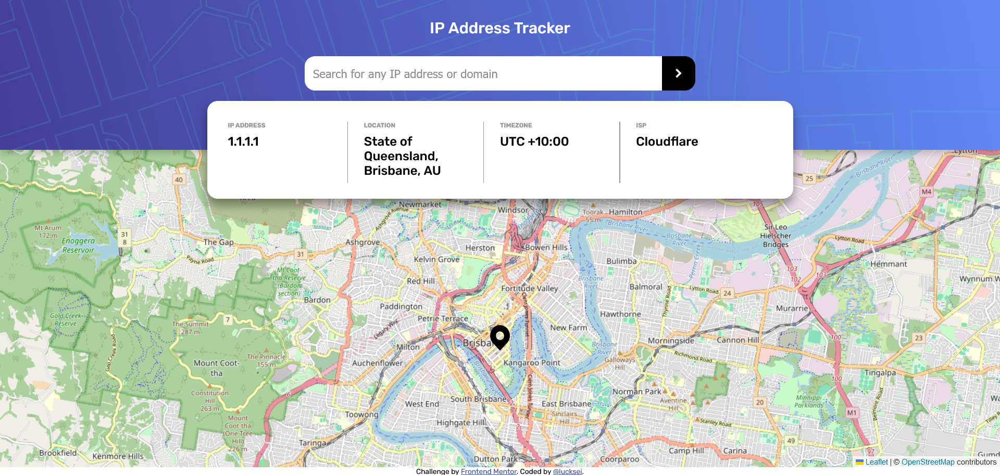

# Frontend Mentor - IP address tracker solution

This is a solution to the [IP address tracker challenge on Frontend Mentor](https://www.frontendmentor.io/challenges/ip-address-tracker-I8-0yYAH0). Frontend Mentor challenges help you improve your coding skills by building realistic projects.

## Table of contents

- [Overview](#overview)
  - [The challenge](#the-challenge)
  - [Screenshot](#screenshot)
  - [Links](#links)
- [My process](#my-process)
  - [Built with](#built-with)
  - [What I learned](#what-i-learned)
  - [Continued development](#continued-development)
  - [Useful resources](#useful-resources)
- [Author](#author)

**Note: Delete this note and update the table of contents based on what sections you keep.**

## Overview

### The challenge

Users should be able to:

- View the optimal layout for each page depending on their device's screen size
- See hover states for all interactive elements on the page
- See their own IP address on the map on the initial page load
- Search for any IP addresses or domains and see the key information and location

### Screenshot



### Links

- Solution URL: [GitHub Repo](https://github.com/lucksei/front-end-mentor-ip-address-tracker)
- Live Site URL: [GitHub Pages](https://lucksei.github.io/front-end-mentor-ip-address-tracker/)

## My process

### Built with

- Mobile-first workflow
- [Sass](https://sass-lang.com/)
- [React](https://reactjs.org/) - JS library

### What I learned

I learned how to effectively use some of react hooks like useEffect, useRef, useContext a little better.

For example, the apiDataProvider hook was an interesting way of managing some more complex states that were shared between components and had to safely be manipulated across the app. Could be better but I'm really proud of how it turned out.

The API calls are made using the [ipify](https://www.ipify.org/) API. This API is not free and requires a paid subscription when the free trial expires (which does when you consume 1000 tokens) therefore i created a crude implementation to safeguard one client from abusing the API by making many calls. It can be bypassed easily by cleaning up the cache and botting but tbh i dont care since this is just a challenge for me.

For the front end, i started having problems creating a modal that would overlap the banner and the map exactly in the middle, thinkering a bit with the code and googling i got it right by using variables shared from the JS, and then accessed by the styles.

This same method allowed me to create a fixed position popup for error messages that always followed the search bar component, which was a challenge to get right.

About this popup, making it a text bubble with a triangle pointing to the search bar was a pain but im glad i made the effort lol. Pasting that code below.

```scss
&::after {
  content: "";
  position: absolute;
  display: block;
  top: calc(-1 * $triangle-height);
  left: calc(16px + $translate-x);
  width: 32px;
  height: $triangle-height;
  @include popup-color;

  /* masking */
  mask: url($triangle-file) no-repeat center;
  -webkit-mask: url($triangle-file) no-repeat center;
  mask-size: contain;
  -webkit-mask-size: contain;
  mask-composite: intersect;
  -webkit-mask-composite: intersect;
}
```

### Continued development

I feel like the project is pretty much done for now,

### Useful resources

- [Quick start using Leaflet](https://leafletjs.com/examples/quick-start/) - A quick start guide for using Leaflet.
- [Quick guide to use React Leaflet](https://react-leaflet.js.org/docs/start-setup/) - A quick guide to use React Leaflet, it complements the Leaflet quick start guide.
- [github.com/alexurquhart/free-tiles](https://github.com/alexurquhart/free-tiles/blob/master/tiles.json) - Free tiles for leaflet.
- [Stack Overflow question about custom marker icon](https://stackoverflow.com/questions/47723812/custom-marker-icon-with-react-leaflet) - This question helped me to create a custom marker icon.
- [Stack Overflow question about passing env variables to webpack](https://stackoverflow.com/questions/46224986/how-to-pass-env-file-variables-to-webpack-config) - Shows how to "securely" pass env variables to webpack when working with node.js i think.
- [Serving Webpack over HTTPS](https://webpack.js.org/configuration/dev-server/#devserver-https) - Useful resource for serving webpack over https since the api calls are done over https and requires this to bypass the cors policy.
- [Regex101 "Domain Name" library](https://regex101.com/library/SEg6KL) - Regex for validating if it is a domain name.
- [Medium article about local storage & react states](https://cgarethc.medium.com/syncing-browser-local-storage-with-react-state-and-the-browser-url-in-a-spa-cd97adb10edc) - Good read about synchronizing local storage with React states.

## Author

- Frontend Mentor - [@lucksei](https://www.frontendmentor.io/profile/lucksei)
- GitHub - [@lucksei](https://github.com/lucksei)
